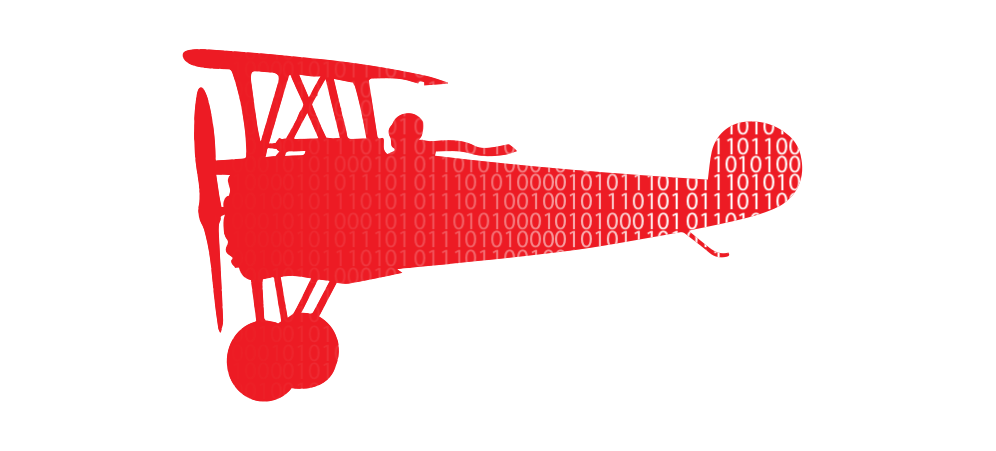

# oculus-dei

An application for managing and monitoring attack surfaces. The main purpose is to create an application which is more or less plug and play for
non-technical people and allows organizations to manage and monitor their attack surface while also sharing information with other
applications.

The documentation should cover how to _install_, _use_ and _contribute_ to the project.

**Thanks for taking a look! :)**

## Table of Contents

<!-- TOC -->

* [Installing](docs/installing/installing.md)
* [Usage](docs/usage/usage.md)
* [Contributing](docs/contributing/contributing.md)

<!-- TOC -->

# [RED BARON SECURITY](https://redbaronsecurity.com)

Project by _Red Baron Security_, if you like it feel free to contact us for collaboration.